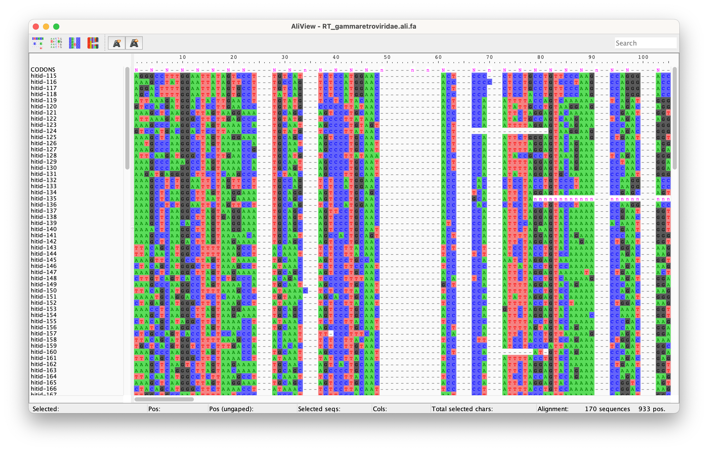

# DVORFS

Disrupted Viral ORF Search (DVORFS) is a tool that uses [GeneWise](https://www.ebi.ac.uk/~birney/wise2/) to find and reconstruct the highly degraded viral ORFs that constitute endogenous viral elements (EVEs) in eukaryotic genomes.

Given an AA multiple alignment or precompiled HMMER format protein profile HMM (pHMM) of a protein domain, DVORFS will search a set of DNA sequences (e.g. a genome) in 3 stages:
1. Presearch stage – the DNA sequences are windowed and translated, then searched with HMMER using lenient thresholds, then translated hit coordinates are converted back to DNA coordinates. (This stage can be skipped entirely, or a predefined set of regions can be supplied in BED format for stage 2 instead of the presearch hits - this could be useful if you want to use an alternative presearch method, e.g. RepeatMasker, BLAST, DIAMOND or something else entirely.)
2. Search stage – hit locations from the presearch, as well as their flanking regions, are windowed and searched using the 3:33L model in GeneWise.
3. Post-process stage – the coordinates and predicted coding sequences of hits from the search stage are combined where appropriate and filtered to meet desired threshold values.

The output of DVORFS is a set of hits and the corresponding predicted amino acid sequence of the EVE domains as well as a preliminary codon alignment for each query domain based on the query pHMM.


### Why DVORFS?

DVORFS is particularly good for EVE mining because:
+ It searches based on amino acid homology using a protein profile query instead of individual query sequences which helps for detecting highly divergent viral sequences.
+ It does this using GeneWise, which natively searches DNA using the protein profile and can thus  incorporate frameshift mutations into its search model. This is great for extracting the full length of pseudogenised EVE sequences.
+ By accounting for frameshifts, a reasonable estimate of the non-pseudogenised amino acid sequence is reconstructed and can be used in downstream analyses.

## Installation

### Install latest github version
Install the latest version from github using conda to install the dependencies:
```shell
git clone https://github.com/ilevantis/dvorfs.git
cd dvorfs
conda env create -f environment.yml
conda activate dvorfs
python setup.py install
```

### Dependencies:
DVORFS is implemented in Python 3 and makes use of:
+ GeneWise as the core tool for searching for EVEs in a genome
+ BEDTools for manipulating genomic coordinates and extracting specific regions of fasta files
+ EMBOSS transeq (for efficiently translating DNA sequence for searching with HMMER)
+ HMMER3 for carrying out rapid preliminary searches of large genomes.


## Usage

DVORFS is intended to be used with selected pHMMs from databases such as PFAM (El-Gebali et al. 2019), GyDB (Llorens et al. 2011), and SUPERFAMILY (Gough et al. 2001) or from pHMMs derived from user curated protein sequence alignments.


### Example

Searching the [zebra finch genome](https://www.ncbi.nlm.nih.gov/assembly/GCF_008822105.2) for hepadnavirus EVEs using [hepadnavirus PFAM pHMMs](http://pfam.xfam.org/search/taxonomy?q=Hepadnaviridae).

```shell
samtools faidx bTaeGut2_pat_W_v2.fasta  # ensure the fasta is indexed
dvorfs -f bTaeGut2_pat_W_v2.fasta --seed pfam_hepadnaviridae.sto -p 12 --filter no-overlap
```


### Input

**Subject:** An indexed fasta file to search for viral protein domains.

**Query:** A stockholm file with query amino acid alignments e.g. seed alignments from PFAM. Or a fasta file with an amino acid MSA. Or HMMER3 format file with pHMMS e.g. from PFAM. Or HMMER2 format file with pHMMS e.g. from GyDB.

**(Search regions):** Instead of using inbuilt HMMER3 presearch, use a set of regions defined in a bed file within which to carry out the search phase.


### Output

By default a file named `dvorfs.hits.tsv` is created listing the found hits (positions are BED-style 0-indexed). The predicted amino acid sequences also contain some characters with special meanings:
+ `?` - codon containing bp deletion
+ `&` - codon containing bp insertion
+ `!` - nonsense frameshifting insertion between two recognisable codons
+ `x` - runs of `x` denote gaps between two alignment sections, the length is determined by how many positions of the pHMM are missing from the alignment.

Example DVORFS output hit table:
```
id   bits    query                   qstart  qend  target        tstrand  tstart     tend       no_hsps  matches  aaseq
29   225.34  RT_betaretroviridae     0       100   NC_000001.11  -        896104     896404     1        101      LENGHIAPTFSPWNSPVFIIKKKSGKWRMLTDLRAINSVIQPMEI*QPGLPSPTIIPKNWPLIVTDLKDCFFTTLLAEQDCERFAFTIPAVNNLQPAKRF
177  229.32  RT_gammaretroviridae    0       237   NC_000001.11  -        4185393    4185929    2        181      LQHGLLKPIHSPYNSPISPVLKPDQAYRLVQDLCLINQIVLPTHPVVPNPYTLLSSIPPSTTHYSVLDLKHAFFTIPLHPSSQPLFAFTWTDPDTHQPQQITWAVLPQGFTDSPHYFSQxxxxxxxxxxxxxxxxxxxxxxxxxxxxxxxxxxxxxxxxxxxxxxxxxxxxxxxxxxAQISSSSVTYLSIILIK?THDLPANHVQLISQTPIPSTKQQLLSFLGMVRYF*L*IPGFA
231  174.85  RT_gammaretroviridae    0       120   NC_000001.11  +        5047892    5048252    1        121      LQHGLLKPKNSPYNSPILPVLKPDKPYKFVQDLCLINQIVLPIHPMVPNPYTLLSSIPASITDYSVLDLKHAFFTIPLHT*SQPLFTFTWTDTDTHQAQQITWAVLLQSFTDSPHYFNQA
243  169.16  RT_gammaretroviridae    0       120   NC_000001.11  +        5116167    5116525    1        121      LQHGLLNAINSPYNSPILPVLKPDKPYKLVQDLCLINQIVLPIHPVVPNPY?LLSSIPSSTTHYSMLDLKDAFFTIPLHPSSQPLFAFT*TDPDTH*AQQITWAILPQAFTDSPHYFSQA
159  278.22  RT_gammaretroviridae    0       237   NC_000001.11  -        6565827    6566527    1        238      CSRGLL*PTHSPCNTPILPIKKSDGSY*LVQDLQAINQAVL?IHPVVPNLYTLLSLIPSSTTHYTAIDLKDDFFTISLHPDSQNLFAFTWTDPDTLQSQQLIGTVLLQGFRNGPHFFGQVIAQDLTSLDLSPSRLLQYVDDLLLCSPSLEDSQTHTITLLNFLANKAYGVSPSKAQLSTPTVTYLGVQLSPGAQAMTLAWVALIDSLPPPSSKSEILSFLG?AGFFRIWIPNFA
172  238.08  RT_gammaretroviridae    0       237   NC_000001.11  +        8923856    8924831    2        239      HACGLLRPTRSPYNTPIL?VKKSDGSY*LVQEL*AVNQAVLPIHPIDPNPYTLLFLIP?DTTHYTAIDPKKDAFFTIPLYLDSQDLFAFTWTDPDILQSQQLTWTVLPQGFRDSPHFFGQTFTQDLTSLDLSPSRLLQYVDDLLLCSPSLKDSQTHTVTLLNFLAAKGHRVSPSRAQLSIPKVTCSGVQLSPGAQAMTQP?AALINNLPPPSSKDEILSFLGLAGFFRIQIPNFA
167  249.96  RT_gammaretroviridae    0       237   NC_000001.11  +        9090440    9091139    1        238      LAANILIPTHSSHNNPILPIKKQDGSYRLDQDLRQINSAFVPVYPVVPNPYNLLS*IPPNTSNFSVISLKDAFFTIPLHTSSQNLFALTWTDPDTGCSQQLT?TVLPQGFRDSPHYFCQALQLDLSQLPLQPSILLQYVDNLLLCSHSLKYCIQHTTKLLNFLAEWVLG?SKRKAQLTSPKVSYLGLIITPNIQDILSAQKQRVQQIPFPKIRRDLLSFLGLVGYF*IWIANFA
299  41.25   RT_spumaretroviridae    0       42    NC_000001.11  -        9496959    9497085    1        43       EEAGVVTPTTSPFNSPIWPVQKTDGLWKLIVDYCKLNQVATP
60   85.66   RT_epsilonretroviridae  0       241   NC_000001.11  -        12392951   12393641   2        172      KDAGVVIPTTSLFNSSIWPVQKTDGSWRITVDYRKLNQMVTPIAAAVPDVGFHCLSKLT&PGTWYAATDLANAFFSIPVHKAYQKQFAFSWQS*QYTFTVL!PQGYINSPGLCHNLIWRDLDCFLLPQNITLVHYTDDIMxxxxxxxxxxxxxxxxxxxxxxxxxxxxxxxxxxxxxxxxxxxxxxxxxxxxxxxxxxxxxxxxxxxxxxxPTTKKELQCLVGLFGFWRQHIPHLG
246  161.84  RT_gammaretroviridae    0       237   NC_000001.11  -        12653630   12654307   2        209      LKHGLLVPGRSPCNTPVFPVQKPNSSSRL?NETVILLHPIVPNLYTVFTQILGDTNWFMVLDLMDGFSLHPESQYLFAFERTDPGTTISLQHTWMVLPPGFxxxxxxxxxxxxxxxxxxxxxxxxxxxxxxYVDIILVCSPSERTQRRMA?QVLNFLGKRGYRFSSSKAQISKPEV!KYPGHILSPGNQTLSIK*KEAVLKVGPPQTKQQLRTFLGVPRFYRIWIPGFA
122  369.97  RT_gammaretroviridae    0       237   NC_000001.11  -        12709870   12710568   1        238      IKDGLLEPCMSPYNTPILPVKKSDRSYQLVKDLRAINKIVQTTYPVVPNPYTILSKIPYNHQWFTVIDLKDAF*ACPLAEDNQVIFAFEWEDPHSGWKQQY*WTVLPRGFTDSPNLFSQILEQVLEKIFIPEQICLLQYVDDLLISGE&KTDFSTHILNHLQFEGL*VSKRKLQYVEPEVKYLGHLISAGKQRIGPE*IKGIVSLPLPQTKQELRKFLGLVRYCHLWTDSYA
112  29.36   RT_epsilonretroviridae  58      109   NC_000001.11  +        12779542   12779698   1        52       LLCKVTTDSKWYPVRDFSSAFLRIPVDEESQYLLAFT*KIQQHAWVVTPQGF
...
```

And a set of "explicit codon alignment" files is generated in the dvorfs.alis directory. One fasta file for each query, with the sequence names corresponding to the id column in the tsv file. These codon alignments explicitly specify the start of each codon using a reference row and thus are capable of handling frameshifting indels properly. Explicit codon alignments can be manipulated in useful ways using [codger](https://github.com/ilevantis/codger), such as combining alignments and realigning according to an amino acid alignment created using something like MAFFT.

Example DVORFS output alignment:


Note: These alignments represent the alignment of each sequence individually to the pHMM (not to each other) and should only be considered preliminary in terms of being an MSA. For generating a proper MSA from these files see the [example using codger](https://github.com/ilevantis/codger).


### Post-processing details

Post-processing of genewise hits does the following:
1. For each query, worse hits that overlap better hits in the subject fasta are removed.
2. For each query, short hits that are consecutive on the query pHMM and consecutive in the subject fasta (and within a set distance) are combined. Where two shorter hits have been merged during the post-processing stage, a string of 'nnn' codons will be inserted between the two sections of predicted sequence. The number of 'nnn' codons corresponds to the number of codons missing compared to the pHMM, not to their distance in the subject fasta.
3. If "no-overlap" filtering is used, only the best hit is retained where hits from different queries overlap. If "best-per" filtering is used, only the best hit across queries is kept for each separate contig in the subject fasta.
4. If a hit mask is used, any hits that fall entirely within the specified query regions are removed. (This is useful for removing spurious hits to low complexity regions of queries).

Installing DVORFS also makes the `process-genewise` command available for carrying out this step separately from the rest of the DVORFS pipeline. Run `process-genewise -h` for details.


### Arguments

```
usage: dvorfs [-h] [-v] -f FASTA [-i FAI] (--hmm2 HMM2 | --hmm3 HMM3 | --seed SEED)
              [-b BED] [--full-search] [--presearch-slop PRESEARCH_SLOP]
              [-p PROCS] [-o OUTDIR] [--prefix PREFIX] [-d WORKDIR] [-k]
              [--nuc-tsv] [--full-tsv] [--noali]
              [--nomerge] [--merge-distance MERGE_DISTANCE]
              [--filter {all,no-overlap,best-per}]
              [--bit-cutoff BIT_CUTOFF] [--length-cutoff LENGTH_CUTOFF] [--hit-mask HIT_MASK]


optional arguments:
  -h, --help            show this help message and exit
  -v, --version         show program's version number and exit


Input target sequence:
  -f FASTA, --fasta FASTA
                        Input fasta file.

  -i FAI, --fai FAI     Input fasta index file (default: <input.fasta>.fai).


Input query profiles:
  --hmm2 HMM2           Input query hmm file (HMMER2 file format).

  --hmm3 HMM3           Input query hmm file (HMMER3 file format).

  --seed SEED           Input query seed alignment file (stockholm or fasta format).


Presearch:
  --presearch-slop PRESEARCH_SLOP
                        Size of flanking regions next to presearch hits in which to search
                        (default: 3000).

  -b BED, --bed BED     Skip presearch step and use a bed file to limit search regions.

  --full-search         Skip presearch step and run genewise on the whole input fasta.
                        WARNING: this can take a very long time.


Runtime/output:
  -p PROCS, --procs PROCS
                        Number of processor threads to use for running HMMER and GeneWise.

  -o OUTDIR, --outdir OUTDIR
                        Output directory. Defaults to current working directory.

  --prefix PREFIX       Prefix for output files (default: "dvorfs").

  -d WORKDIR, --workdir WORKDIR
                        Directory in which DVORFS will save files during a run (default:
                        <outdir>/dvorfs.tmp).

  -k, --keep-workdir    Do not delete the temporary working directory after DVORFS has finished.

  --nuc-tsv             Nucleotide sequences with comma separated codons are included in output tsv.

  --full-tsv            Extra columns containing postprocessing details are included in  output tsv.

  --noali               Do not output explicit codon alignments of hits.


Hit postprocessing and filtering:
  --nomerge             Adjacent GeneWise hits will not be merged.

  --merge-distance MERGE_DISTANCE
                        Maximum allowed distance between GeneWise hits to be merged.

  --filter {all,no-overlap,best-per}
                        all: All hits are kept (default).
                        no_overlap: Hits are removed if they are overlapped by a better hit from a
                        different query.
                        best_per: Only the highest scoring hit per contig is kept.

  --hit-mask HIT_MASK   Three column TSV file for filtering out hits based on query regions.

  --bit-cutoff BIT_CUTOFF
                        Bit score threshold for reported hits (default: 15.0).

  --length-cutoff LENGTH_CUTOFF
                        Length threshold (no. of codons) for reported hits (default: 30).

```
